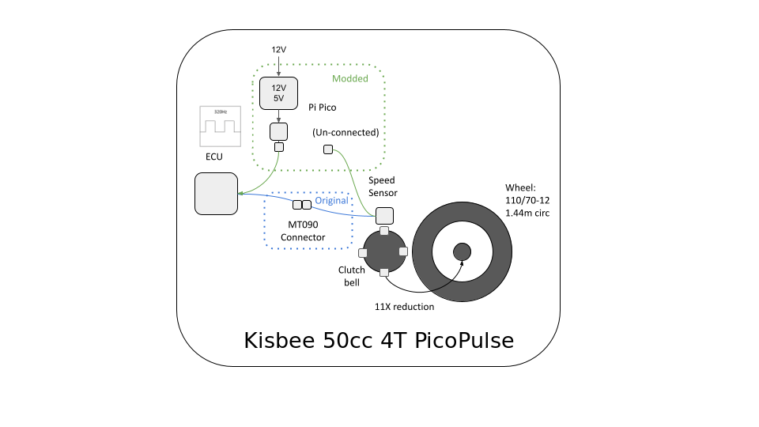
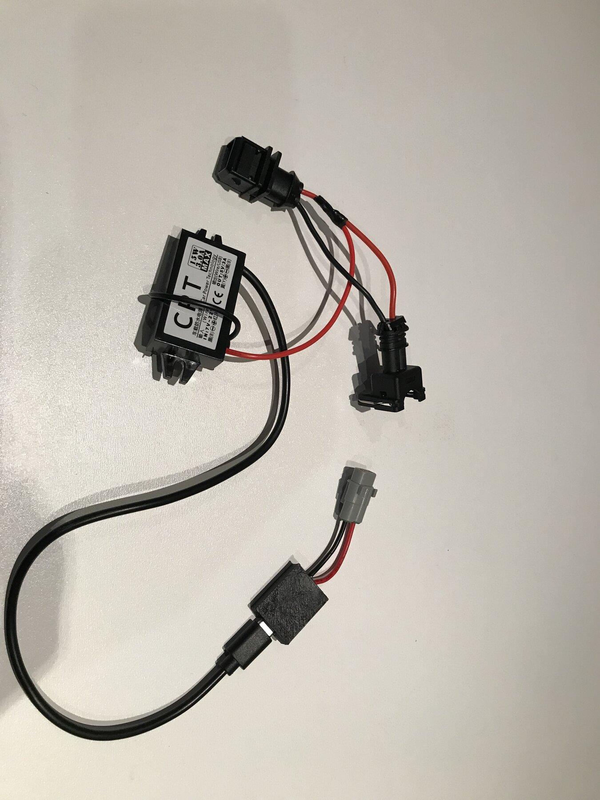
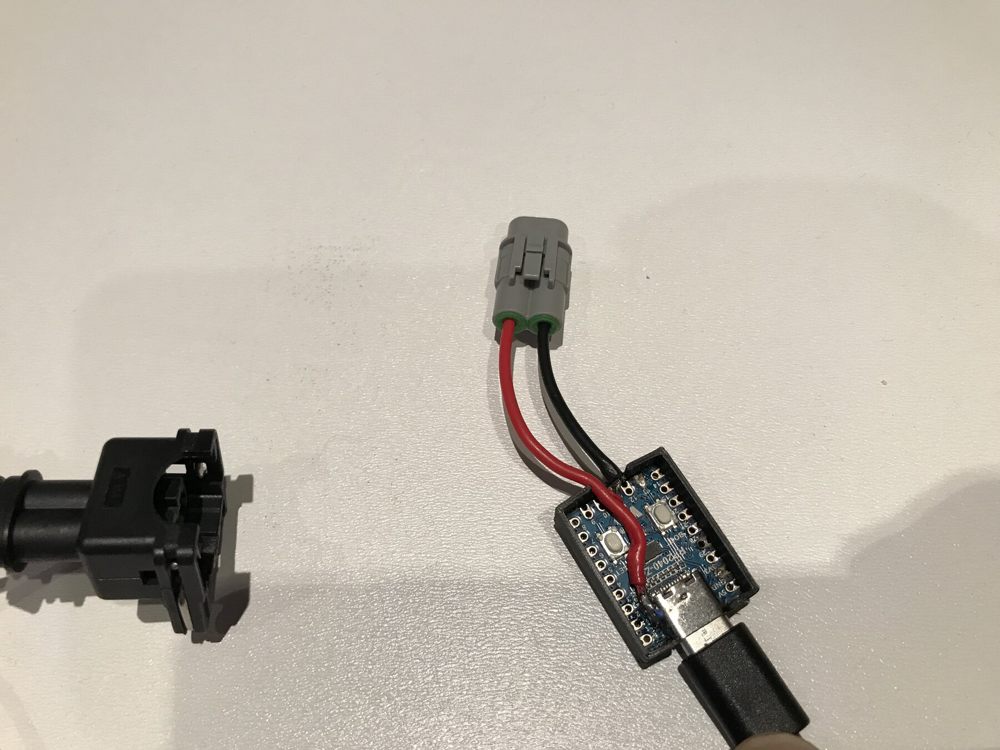
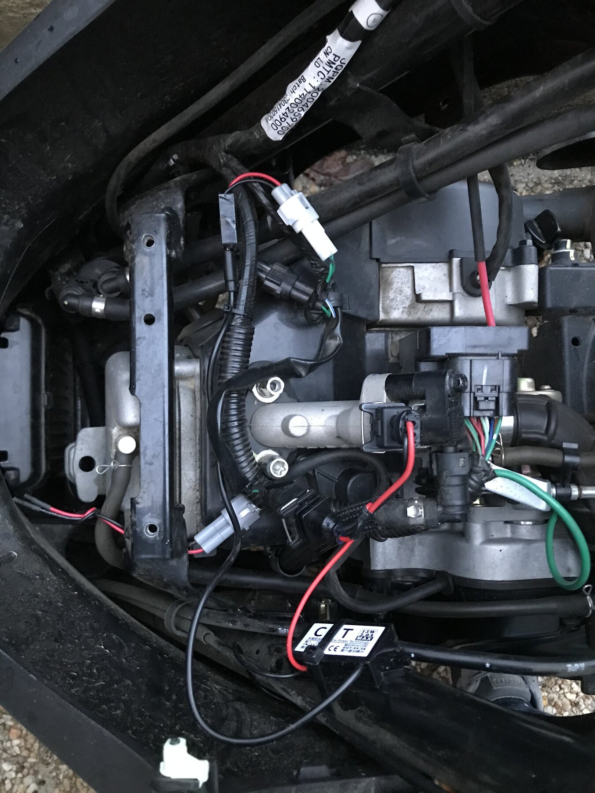

# 🐝 Kisbee 50cc 4T PicoPulse — Émulateur de signal de vitesse RP2040

[English version](README.md)

> [!WARNING]
> Ce projet est une expérimentation pédagogique, pas un produit homologué pour la route. Modifier
> le système de limitation d’un véhicule peut être illégal, dangereux et incompatible avec son
> assurance ou son homologation.

Ton Peugeot Kisbee 50 4T est bridé électroniquement : l’ECU surveille le signal d’un capteur de
vitesse et commence à couper la puissance lorsqu’il estime que tu roules trop vite (en pratique
≈ 45 km/h).

Ce projet utilise une petite carte RP2040 sous MicroPython pour **se faire passer pour le capteur de roue**
et envoyer à l’ECU un signal de « vitesse faible » crédible, même si le scooter roule en réalité
plus vite.

Simple, pas cher, réversible. 🙂

## Contenu du dépôt

- [`kisbee.py`](kisbee.py) — firmware MicroPython, installé sur la carte sous le nom `main.py`.
- [`diagram.png`](diagram.png) — vue d’ensemble conceptuelle du chemin du signal.
- [`images/`](images/) — photos du montage et de l’installation nettoyées de leurs métadonnées privées.

## Origine et référence

Les premières recherches de ce projet se sont appuyées sur les expérimentations de la communauté
présentées dans [« Débridage du Peugeot Kisbee 4T Euro 5 de 2021 avec Arduino (également compatible
Euro 4) » sur Reddit](https://www.reddit.com/r/scooters/comments/13rbkxj/2021_peugeot_kisbee_4t_euro5_derestriction_using/?tl=fr).
Merci à l’auteur de la publication et aux contributeurs d’avoir partagé leurs découvertes.

---

## Comment fonctionne le bridage d’origine



*Vue conceptuelle du chemin du signal, et non schéma électrique broche par broche. L’interface ECU
et les protections nécessaires sont décrites dans la partie déploiement.*

Sur un Kisbee d’origine :

- Un **capteur** regarde la **cloche d’embrayage**, qui possède **4 excroissances** (bosses).
- La **réduction finale** entre la cloche d’embrayage et la roue arrière est fixe : la cloche tourne
  environ **11× par tour de roue**.
- Donc l’ECU voit :

  - `4 impulsions / tour de cloche × ~11 tours de cloche / tour de roue ≈ 44 impulsions / tour de roue`.

- Avec un pneu arrière classique (110/70-12), la circonférence de la roue est d’environ **1,44 m**.

On peut en déduire approximativement :

```text
f_Hz ≈ 8,5 × v_kmh
```

Exemples (transmission d’origine & 110/70-12) :

| Vitesse roue | Fréquence capteur |
| -----------: | ----------------- |
|      30 km/h | ≈ 255 Hz          |
|      40 km/h | ≈ 339 Hz          |
|      45 km/h | ≈ 381 Hz          |
|      50 km/h | ≈ 424 Hz          |
|      60 km/h | ≈ 509 Hz          |

Les retours de la communauté et des mesures à l’oscilloscope indiquent que, sur la version 45 km/h,
l’ECU commence à limiter un peu en dessous de **~400 Hz** (≈ 45 km/h d’après le tableau).

**Idée clé :** si on maintient la fréquence *vue* par l’ECU en dessous de ce seuil, il n’active pas
le bridage, même si la vitesse réelle de la roue est plus élevée.

### Pourquoi ne pas simplement débrancher le capteur de vitesse ?

Débrancher le capteur ne fonctionne **pas** :

* L’ECU vérifie en permanence qu’un **train d’impulsions valide** est présent.
* Si le signal disparaît (circuit ouvert, pas d’impulsions, niveau constant), l’ECU détecte un défaut.
* Dans ce cas :

  * Le **témoin de défaut ECU** s’allume.
  * L’ECU passe en **mode dégradé** avec une **vitesse maximale encore plus faible** que l’origine.

Au lieu de supprimer le signal, il faut donc le **remplacer par un signal plausible** :
un signal qui ressemble à une vraie sortie de capteur, mais qui reste en dessous du seuil de bridage.
C’est exactement ce que fait ce projet.

---

### Solution mécanique classique : modifier la cloche d’embrayage

Une astuce « atelier » très courante pour contourner le bridage consiste à **réduire physiquement le
nombre de bosses / dents** vues par le capteur sur la cloche d’embrayage.

D’origine, la cloche possède **4 excroissances** qui passent devant le capteur.
Certains bricoleurs :

* Ouvrent la transmission,
* Déposent la cloche d’embrayage,
* **Meulent ou coupent 2 des 4 excroissances**.

Résultat :

* Pour la même vitesse réelle de la roue, le capteur voit maintenant **deux fois moins d’impulsions**.
* L’ECU croit que le scooter roule **deux fois moins vite** qu’en réalité, il n’atteint donc jamais
  la fréquence de bridage.
* C’est fonctionnellement similaire à ce que l’on fait en électronique : **réduire la fréquence apparente**
  vue par l’ECU.

Mais cette approche mécanique a plusieurs inconvénients :

* Elle demande **plus de démontage** (carter, courroie, embrayage, cloche, etc.).
* Une fois les excroissances coupées, ce n’est **plus vraiment réversible** :

  * Pour revenir à l’origine, il faut **racheter une cloche neuve**.
* L’usinage doit être propre et symétrique :
  un mauvais équilibrage ou des bavures peuvent créer des **vibrations** ou réduire la durée de vie
  des pièces.

La solution à base de RP2040 proposée ici obtient **le même effet sur la fréquence**, mais :

* **Sans modification permanente** du moteur ou de la transmission,
* **Facilement réversible** (on débranche la boîte et on rebranche le capteur),
* Et démontable / remontable en quelques minutes.

---

## Bases techniques – Ce que fait réellement le RP2040-Zero

Le firmware MicroPython est un petit générateur d’impulsions à fréquence fixe, avec LED d’état intégrée :

* Au démarrage, il allume la LED RGB intégrée en **vert**.
  Cela confirme que `main.py` a atteint l’étape d’initialisation ; la LED ne garantit pas à elle
  seule que le signal côté ECU est correct.

* Il produit en continu un train d’impulsions courtes sur le **GPIO 11** à **320 Hz**.
  Avec la transmission et le pneu d’origine du Kisbee, cela correspond à environ **38 km/h**, bien
  en dessous du seuil de bridage de l’ECU (~380–400 Hz).

* Chaque période vaut :

  * `1_000_000 / 320 ≈ 3125 µs` au total,
  * avec une **impulsion active à l’état haut de 200 µs** sur le GPIO 11 et le reste au repos, soit
    environ **6 % de rapport cyclique**.

* Le timing est basé sur `utime.ticks_us()` :
  le code planifie le front suivant en microsecondes, ce qui maintient la fréquence moyenne proche de
  320 Hz, même si MicroPython introduit un peu de gigue.

* Côté scooter, ce signal 3,3 V est transformé en signal compatible capteur/ECU via une petite interface :
  typiquement une **résistance de rappel (pull-up) + étage “tirer uniquement vers le bas”**
  (type open-drain) ou un petit **transistor / MOSFET** pour imiter le comportement du capteur
  d’origine. Cet étage peut inverser l’impulsion produite par le microcontrôleur.

En pratique, le capteur de roue réel est déconnecté de l’ECU, et ce firmware lui envoie à la place un
signal constant et crédible du style « je roule à ~38 km/h ».
Le variateur et le moteur peuvent alors dépasser la vitesse de bridage d’origine sans que l’ECU ne
retarde l’allumage ni ne signale de défaut de capteur.

---

## Déploiement

### 1. Matériel nécessaire

* **Convertisseur 12 V → 5 V DC-DC correctement dimensionné** et un petit fusible en ligne (pour
  passer du 12 V scooter au 5 V / USB de la carte)
  Exemple : [module abaisseur 12 V → 5 V](https://www.amazon.fr/dp/B0FKM9X3J4)

* **Carte RP2040-Zero compatible Waveshare**. Le firmware fourni utilise le GPIO 11 pour le signal
  et le GPIO 16 pour la LED RGB de cette carte. Avec une autre carte RP2040, il faut adapter ces
  broches et éventuellement le code de la LED.
  Caractéristiques : [Waveshare RP2040-Zero](https://www.waveshare.com/rp2040-zero.htm)

* **Interface pour le signal ECU**, par exemple un étage transistor/MOSFET open-drain correctement
  dimensionné avec les résistances de rappel nécessaires. Ne jamais relier directement un signal
  ECU ou 12 V à un GPIO du RP2040.

* **Connecteurs / kit de cosses auto** pour faire un faisceau propre en dérivation sur le capteur de vitesse ECU
  Exemple : [assortiment de connecteurs](https://www.amazon.fr/dp/B0FBWDKK8L)

* **Boîtier résistant aux intempéries, fil, gaine thermo, serre-câbles et colliers de fixation**.

Les références et les prix peuvent évoluer ; les liens ci-dessus sont des exemples et non des
recommandations commerciales. Vérifie la tension, le brochage et l’adéquation de chaque composant
avant de le commander ou de le brancher.

---

### 2. Câblage & montage

> **À faire à tes risques et périls ; vérifie bien polarités et connexions.**



*Faisceau enfichable complet avant installation : connecteurs automobiles, convertisseur
d’alimentation et contrôleur RP2040 dans son boîtier.*

1. **Alimentation :**

   * Travailler contact coupé et débrancher la batterie avant de modifier le faisceau.
   * Prendre le **12 V** et la **masse** du scooter, de préférence sur une ligne protégée par un
     fusible et alimentée après contact.
   * Les entrer dans le **convertisseur 12 V→5 V**.
   * Vérifier la polarité et la sortie 5 V du convertisseur au multimètre avant de brancher la carte.
   * Alimenter le RP2040-Zero par son port USB-C ou son entrée 5 V/VSYS prévue à cet effet, jamais
     par sa broche 3,3 V.
   * Vérifier que la masse du RP2040-Zero et celle de l’ECU sont bien communes.

2. **Signal de vitesse :**

   * Identifier le connecteur du capteur de vitesse et le fil du signal côté ECU pour le modèle et
     l’année exacts du scooter ; le câblage peut varier.
   * Débrancher le **connecteur du capteur de vitesse** et amener le côté ECU dans la petite boîte.
   * Relier le **GPIO 11** (`PIN = 11` dans `kisbee.py`) à l’entrée basse tension de l’étage d’interface.
   * Relier l’entrée « vitesse » de l’ECU à la sortie de cet étage d’interface.
   * Ne jamais appliquer du 5 V, du 12 V ou un signal ECU non vérifié directement sur le GPIO du RP2040.
   * Garder le connecteur d’origine du capteur accessible pour pouvoir revenir facilement en configuration stock.

   

   *Gros plan du RP2040-Zero raccordé au faisceau d’injection du signal, avant la fermeture du
   boîtier.*

3. **Montage mécanique :**

   * Mettre le RP2040-Zero + le DC-DC + l’éventuel petit PCB d’interface dans un **boîtier résistant
     aux intempéries** et protéger les connexions avec de la gaine thermo.
   * Fixer l’ensemble sous la selle ou le carénage avec des **colliers**, à l’écart de l’échappement
     et des pièces mobiles.
   * Ajouter des serre-câbles et s’assurer que les fils ne peuvent ni frotter, ni se coincer, ni
     retenir de l’eau.

   

   *Exemple du système final installé sous le carénage du scooter.*

Au final, tu obtiens un **faisceau enfichable** qui peut être retiré pour repasser entièrement en origine.

---

### 3. Programmation du RP2040-Zero

Cette étape se fait une fois pour toutes. Ensuite, la séquence normale au démarrage est :
**contact ON → LED verte → vérifier le fonctionnement normal**.
Programmer la carte sur l’établi, débranchée du faisceau et de l’alimentation du scooter.

1. **Flasher MicroPython :**

   * Télécharger le dernier UF2 stable depuis la
     [page MicroPython officielle du Waveshare RP2040-Zero](https://micropython.org/download/WAVESHARE_RP2040_ZERO/).
   * Maintenir **BOOTSEL** sur le RP2040-Zero et le brancher au PC en USB.
   * Un disque `RPI-RP2` apparaît.
   * Copier le fichier UF2 téléchargé dessus, puis attendre le redémarrage de la carte.

2. **Installer [`mpremote`](https://docs.micropython.org/en/latest/reference/mpremote.html) sur le PC :**

   ```bash
   pipx install mpremote
   ```

   Autre possibilité :

   ```bash
   python3 -m pip install --user mpremote
   ```

3. **Copier le script en `main.py` (exécution automatique au démarrage)** depuis le répertoire du dépôt :

   ```bash
   mpremote fs cp kisbee.py :main.py
   mpremote reset
   ```

   `mpremote` sélectionne automatiquement le premier périphérique série USB. Si plusieurs cartes
   sont connectées, exécuter `mpremote connect list`, puis ajouter `connect <port>` avant `fs cp`.

   Ensuite, à chaque mise sous tension, le RP2040-Zero démarre automatiquement et génère les impulsions.

---

### 4. Validation sur l’établi

* Vérifier que la LED d’état s’allume en **vert**.
* À l’oscilloscope ou à l’analyseur logique, vérifier une fréquence d’environ **320 Hz** avec une
  **impulsion active à l’état haut de 200 µs** sur le GPIO 11.
* Tester séparément l’étage d’interface et confirmer que sa tension et sa polarité côté ECU
  correspondent au capteur d’origine avant de le raccorder au scooter.

---

### 5. Utilisation sur le scooter

* Brancher le RP2040-Zero sur la **sortie 5 V** du convertisseur dans le scooter.
* Mettre le contact pour alimenter le convertisseur 12 V→5 V et donc la carte.
* Vérifier la **LED verte** sur la carte :

  * **LED verte allumée** → le script s’est initialisé. Elle ne remplace pas les contrôles
    électriques décrits ci-dessus et ne confirme pas à elle seule que l’ECU reçoit le signal attendu.
* À partir de là, l’ECU croit voir un ~38 km/h constant – ce que tu fais de la **vitesse réelle** est de ta responsabilité.

Roule prudemment. 🏆

---

## Sécurité, légalité & responsabilité

Ce projet est **expérimental** et publié à des fins **purement pédagogiques**.

* Il est pensé comme un moyen de **découvrir l’électronique, les microcontrôleurs et les ECU**,
  notamment pour des jeunes qui veulent comprendre techniquement le fonctionnement de leur scooter.
* Nous **ne vendons volontairement pas de kits tout faits** :
  l’idée est que toute personne utilisant ce projet **conçoive, câble et comprenne son propre montage**,
  et ne branche pas simplement une « boîte noire ».

En utilisant ce code et les idées associées, tu acceptes que :

* Tu es **seul responsable** de toute modification apportée à ton véhicule.
* Tu dois vérifier que ton scooter **reste conforme aux lois et réglementations locales**
  (vitesse maximale des cyclomoteurs, catégorie de permis, homologation, etc.).
* Toute modification des signaux de l’ECU ou de la limitation de vitesse peut :

  * **Affecter la sécurité** (distance de freinage, tenue de route, gravité d’un accident),
  * **Annuler la garantie**,
  * **Modifier la couverture d’assurance** ou la façon dont un expert évaluera un sinistre.

Si ce projet est utilisé par des mineurs, il doit l’être **sous la responsabilité d’un adulte**
qui comprend les risques et le contexte légal.

Rien dans ce dépôt ne constitue un conseil juridique, et l’auteur/les auteurs ne peuvent être tenus
pour responsables :

* De dommages aux personnes, aux véhicules ou aux biens,
* De perte de couverture d’assurance,
* D’amendes, de poursuites ou de toute autre conséquence liée à l’utilisation ou à la mauvaise
  utilisation de ces informations.

En cas de doute, gardez ce projet **sur le banc** comme une expérience d’électronique sympa, et
utilisez votre scooter dans une configuration **entièrement légale**.

---

## Licence et marques

Le code source est distribué sous [licence BSD à 2 clauses](LICENSE).

Les noms « Peugeot » et « Kisbee » servent uniquement à identifier la compatibilité du véhicule.
Ce projet indépendant n’est ni affilié, ni sponsorisé, ni approuvé par le constructeur. Les noms
de produits et de sociétés restent la propriété de leurs détenteurs respectifs.
